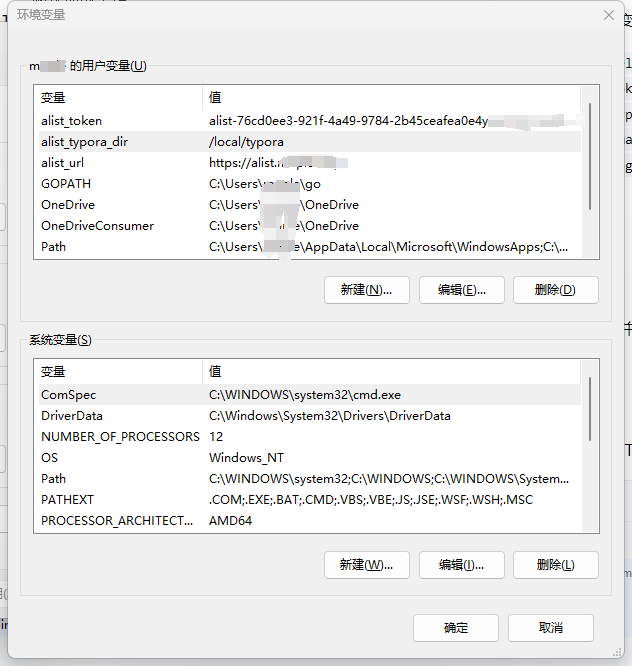
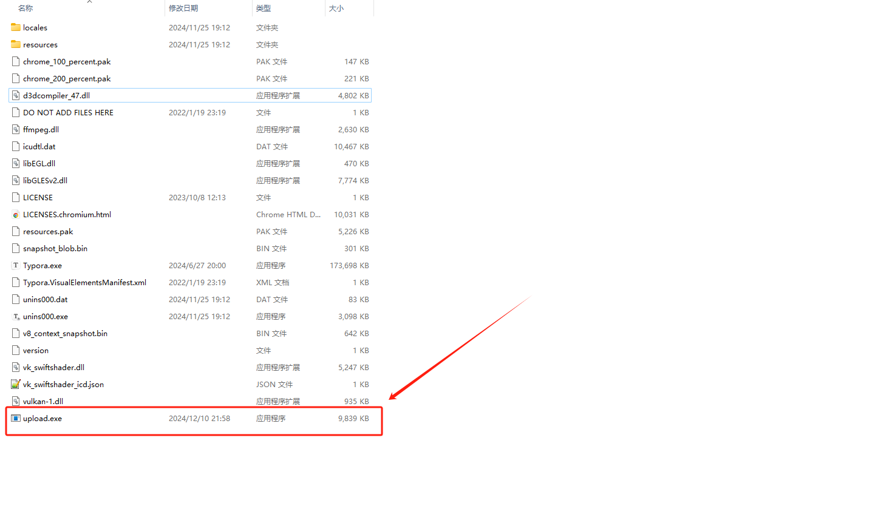
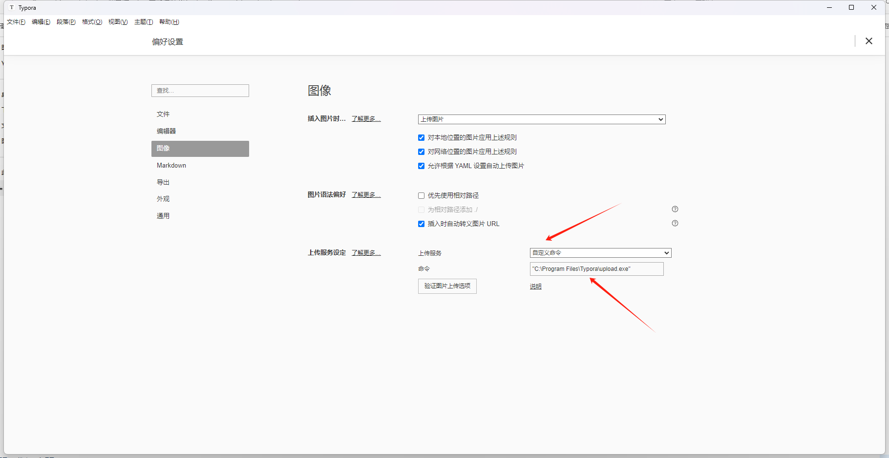
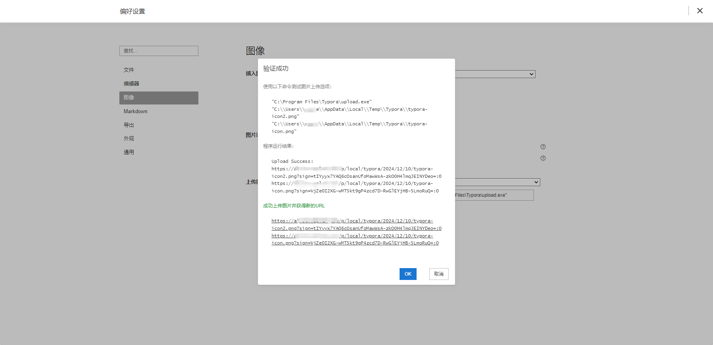
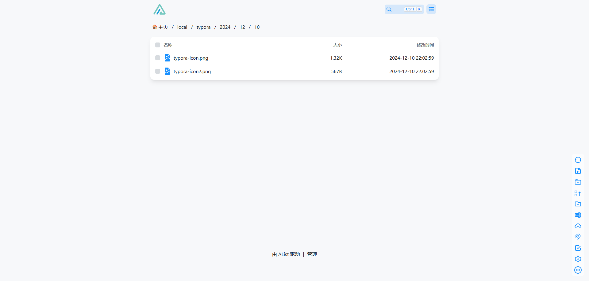

# Typora自定义图片上传工具

  这个项目是一个 <strong>Go </strong>应用程序，主要用于将 <strong>Typora</strong> 中的本地图片自动上传到 <strong>Alist </strong>网盘中并引用对应图片的直链。

## 快速入手

设置以下环境变量：

- `alist_url`：Alist 服务器的基础 URL。
- `alist_token`：Alist 服务器的授权令牌。
- `alist_typora_dir`：Alist 服务器上存储图片的目录。
- `alist_image_ext`：（可选）支持的图片扩展名，逗号分隔。默认值为 `.png,.jpg,.jpeg,.gif,.webp,.bmp,.ico,.svg`。

示例：

从release中下载对应平台的二进制文件，任意放置一个目录

然后在Typora中自定义命令填写对应路径即可。

测试上传图片。

  <strong>警告：</strong> 环境变量配置完成后，软件需要重新启动才能获取到配置的环境变量！

上传的图片除了环境变量指定的路径外，还会在上传图片的时候自动生成当前日期的文件夹，方便管理。

## 许可证

此项目使用 MIT 许可证。详情请参阅 [LICENSE](LICENSE) 文件。
